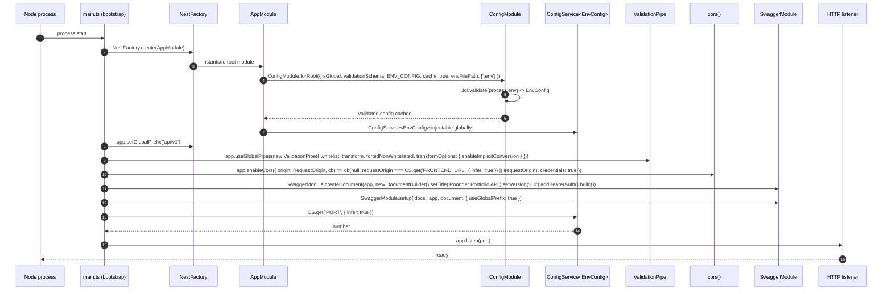

# Design: Bootstrap API Config (prefix, validation, CORS, Swagger)

## Overview

This design wires the four cross-cutting HTTP concerns (`setGlobalPrefix('api/v1')`,
global `ValidationPipe`, CORS, and `@nestjs/swagger`) into the existing
NestJS 11 bootstrap, and replaces the direct `process.env.PORT` read in
`main.ts` with a typed `ConfigService<EnvConfig>` backed by the existing Joi
`ENV_CONFIG` schema. It satisfies the new `api-bootstrap` capability spec
(5 ADDED requirements, 13 scenarios) and the `server_specs` delta (4
MODIFIED, 1 ADDED cross-reference). The design settles six design questions
flagged by the spec sub-agent — DTO collision with `forbidNonWhitelisted`,
the safety boundary of `enableImplicitConversion`, the missing-env-var test
isolation strategy, the Swagger assertion convention, CORS testing of
non-prefixed routes, and the global-prefix-vs-Swagger exclusion question.

## Architecture Decisions

### ADR-1: DTO collision with `forbidNonWhitelisted`

**Choice**: Keep `forbidNonWhitelisted: true` project-wide. The E2E test
for "unknown field rejected" uses a **synthetic controller** registered
only inside the test module — not any existing domain DTO.

**Alternatives considered**:
- (a) Audit and tighten every existing DTO in this PR. **Rejected**: DTOs
  are explicitly out of scope per the proposal; touching them in a
  bootstrap change violates the change's contract and creates noisy
  diffs on `domain/auth`.
- (b) Drop `forbidNonWhitelisted` and rely on `whitelist` alone.
  **Rejected**: the spec explicitly mandates
  `forbidNonWhitelisted: true`; relaxing it fails a requirement.

**Rationale**: The current `LoginDto` (`src/auth/dto/create-auth.dto.ts`)
is an empty stub. No domain DTO is currently in a position to break. A
throwaway test-only controller bound to a DTO that declares exactly one
field (`{ name: string }`) gives us a deterministic fixture to assert the
400 response without coupling the bootstrap test to any domain change.
This keeps the test resilient to future DTO shape changes.

**Test fixture shape** (used only by `test/bootstrap.e2e-spec.ts`):

```ts
// declared in the test file, not in src/
class FixtureDto { @IsString() name!: string; }
@Controller('__bootstrap_fixture')
class FixtureController {
  @Post() post(@Body() dto: FixtureDto) { return dto; }
}
```

### ADR-2: `enableImplicitConversion` coercion safety

**Choice**: Project-wide convention — `@Type(() => Number)` and
`@Type(() => Date)` are **required** on numeric and date fields of any
DTO that is **not** a `@Body()` (i.e., `@Query()` and `@Param()` DTOs).
For `@Body()` DTOs, leave implicit conversion on (the safe default)
and let class-validator reject malformed values.

**Alternatives considered**:
- (a) Turn off `enableImplicitConversion` globally. **Rejected**: it
  removes the convenience that makes query-string pagination (`?page=2`)
  work without per-handler `@Type()` annotations; this is the project
  default everywhere HTTP surfaces are read.
- (b) Require `@Type()` on every numeric/date field, including bodies.
  **Rejected**: bodies are already typed JSON and clients should send
  numbers as numbers; over-annotating body DTOs adds noise.

**Rationale**: Implicit conversion runs on the
[class-transformer `plainToInstance` step](https://github.com/typestack/class-transformer)
that the global `ValidationPipe({ transform: true })` triggers. Coercion
is sound when the wire format cannot carry native types — query strings
and URL path params arrive as strings, so `"42"` → `42` is the
intended behaviour. Body fields, by contrast, have semantic meaning
as strings (e.g., a `slug` field), and a numeric coercion there would
silently rewrite user input. The convention: bodies stay strict; query
and param DTOs annotate explicitly.

### ADR-3: Missing-env-var test strategy

**Choice**: Option (a) — `Test.createTestingModule` with
`ConfigModule.forRoot({ ignore: ['.env*'], validationSchema: ENV_CONFIG,
isGlobal: true })`, with the test stubbing `process.env` to a known
shape that omits `JWT_SECRET` and asserting that `Test.compile()` /
`app.init()` rejects.

**Alternatives considered**:
- (a) `Test.createTestingModule` with `ignore: ['.env*']` + stubbed
  `process.env`. **Chosen.**
- (b) A standalone `scripts/check-env.ts` invoked via `execFile` in the
  test. **Rejected** for this change: it requires a new file, a new
  build artefact, and a new path through `ts-node` — all of which expand
  the surface area of a bootstrap PR. The bootstrap e2e should stay
  inside the existing `test/` harness and the existing
  `jest-e2e.json` runner.

**Rationale**: The bootstrap test is the only consumer of this assertion,
so the cost of a sibling script is unjustified. `Test.createTestingModule`
gives us a real `ConfigService` instance with the real Joi schema; the
test can stub `process.env` per-suite and assert that the module factory
throws (or that `app.init()` rejects with a Joi validation error). The
test lives in `test/bootstrap.e2e-spec.ts` and reuses the same runner,
the same `supertest` patterns, and the same `afterAll` cleanup as every
other E2E test. No new runner, no new build target.

### ADR-4: Swagger path assertion convention

**Choice**: Assert on the JSON body's `openapi` field (the OpenAPI 3.0
required top-level key) and on `info.title` / `info.version` /
`components.securitySchemes`. Do not assert on the path `/api/v1/docs-json`
beyond `expect(200)`.

**Rationale**: The `-json` suffix in `SwaggerModule.setup('docs', ...)`
is a NestJS convention but the actual route string is internal. The
OpenAPI 3.0 spec mandates the top-level `openapi` field on every valid
document, so its presence is the most stable assertion we can make
across Swagger module upgrades. The convention applies to any future
Swagger regression test on this project.

### ADR-5: CORS test for non-prefixed preflight

**Choice**: The E2E test issues two `OPTIONS` requests. The first to a
prefixed route (`/api/v1/auth/login`) with the configured origin asserts
the CORS headers are present. The second to a non-prefixed URL
(`/auth/login`) with the same origin asserts either a 404 **or** a 200
that **does not** carry `Access-Control-Allow-Origin: <frontend>`.
The robust assertion is on the response header, not the status code,
because a misconfigured CORS middleware could attach headers to a 404
response and still be wrong.

**Rationale**: The 404 from a missing prefix and the 404 from a CORS
rejection are indistinguishable in Nest's router; the only reliable
signal is whether CORS headers leaked onto the unprefixed response. This
test pairs with the "unprefixed route is rejected" requirement in the
spec delta (already covered by `GET /projects` → 404) — the CORS
dimension is the new assertion.

**Implementation note** (clarified post-apply): the `cors` package
treats `origin` as a string by reflecting that value on **every**
response, regardless of the request's `Origin` header. To satisfy the
spec's "different origin MUST NOT receive a matching header"
requirement, `app.enableCors` MUST be called with `origin` as a
**function callback** that returns the configured URL for matching (or
non-browser) requests and `false` for everything else. Pseudocode:

```ts
app.enableCors({
  origin: (requestOrigin, callback) => {
    if (!requestOrigin || requestOrigin === frontendUrl) {
      callback(null, true);
    } else {
      callback(null, false);
    }
  },
  credentials: true,
});
```

This is the correct implementation of the spec intent; a string
`origin` would fail the mismatched-origin test.

### ADR-6: Global prefix + Swagger exclusion strategy

**Choice**: Do **not** pass `exclude` to `setGlobalPrefix`. Call
`SwaggerModule.setup('docs', app, document, { useGlobalPrefix: true })`
*after* `setGlobalPrefix('api/v1')`. The `useGlobalPrefix: true` option
on the `setup` call instructs `@nestjs/swagger` to honor the global
prefix when mounting the UI and JSON routes. The Swagger UI registers
under the prefix as `/api/v1/docs` and the JSON route as
`/api/v1/docs-json`, exactly as the spec mandates.

**Alternatives considered**:
- (a) No `exclude`, plus `SwaggerModule.setup('docs', app, document, { useGlobalPrefix: true })`. **Chosen.**
- (b) `setGlobalPrefix('api/v1', { exclude: ['docs', 'docs-json'] })`
  then mount manually with the prefix in the path. **Rejected**:
  the spec asserts `/api/v1/docs` and `/api/v1/docs-json`; option (b)
  would put them at `/docs` and `/docs-json`, failing the spec.
  Re-introducing the prefix into the path is also fragile — it couples
  the Swagger mount to the prefix string in two places.
- (c) No `exclude`, no `useGlobalPrefix` flag. **Rejected**: in
  `@nestjs/swagger@11.4.x`, `SwaggerModule.setup` does NOT pick up the
  global prefix automatically. The routes mount at `/docs` and
  `/docs-json` and the spec's `/api/v1/docs` requirement fails. The
  `useGlobalPrefix: true` option is the documented way to bridge the
  two concerns without resorting to manual path composition.

**Rationale**: NestJS applies `setGlobalPrefix` to *every* route
registered through the router, but `SwaggerModule.setup` registers its
UI and JSON endpoints out-of-band and is therefore NOT picked up by the
prefix machinery by default. The `useGlobalPrefix: true` option on
`setup` is the supported way to align the two. The test asserts
`GET /api/v1/docs` → 200 (HTML UI) and `GET /api/v1/docs-json` → 200
with a body whose `openapi` field is present.

## Bootstrap Sequence



## Failure Modes

| Failure | Behaviour |
|---|---|
| Missing required env var (e.g. `JWT_SECRET`) | `ConfigModule` Joi validation throws on `forRoot()`. `NestFactory.create` rejects. Process exits with the Joi error message. HTTP listener never starts. |
| Malformed env var (e.g. `PORT=abc`) | Joi `Joi.number()` rejects. Same path as missing var — Joi throws at boot. |
| Port already in use | `app.listen(port)` throws `EADDRINUSE`. Process exits with the underlying Node error. |
| CORS preflight from disallowed origin | `app.enableCors` echoes `Access-Control-Allow-Origin` only when the request `Origin` matches `FRONTEND_URL`. Mismatched origin gets no `Access-Control-Allow-Origin` header; the preflight fails in the browser. |
| Body with unknown field | Global `ValidationPipe({ whitelist, forbidNonWhitelisted })` strips nothing and rejects with `400 Bad Request` carrying the class-validator error message naming the unknown property. |
| Request to unprefixed route (e.g. `GET /projects`) | `setGlobalPrefix('api/v1')` rewrites the controller's `@Get()` to `/api/v1/projects`. The router has no handler for `/projects`, so it returns `404 Not Found` with no CORS headers. |

## File-by-file change plan

### `src/main.ts` (modified)

Replace the bare `NestFactory.create + listen(process.env.PORT)` block
with: import `ConfigService` and `EnvConfig` types; `app.setGlobalPrefix('api/v1')`
(no `exclude`); `app.useGlobalPipes(new ValidationPipe({ whitelist: true, transform: true, forbidNonWhitelisted: true, transformOptions: { enableImplicitConversion: true } }))`;
`app.enableCors({ origin: <function callback per ADR-5>, credentials: true })`;
`SwaggerModule.createDocument` with `new DocumentBuilder().setTitle('Roonder Portfolio API').setVersion('1.0').addBearerAuth().build()`;
`SwaggerModule.setup('docs', app, document, { useGlobalPrefix: true })`;
`await app.listen(configService.get('PORT', { infer: true }) as number)`.
The file MUST NOT contain any `process.env.*` reference after the change
(spec Requirement: Typed Environment Access).

### `src/app.module.ts` (modified)

Add `ConfigModule.forRoot({ isGlobal: true, validationSchema: ENV_CONFIG, cache: true, envFilePath: ['.env'] })` to the `imports` array. The four
domain modules remain unchanged.

### `src/config/env.config.ts` (read-only)

No change. The Joi schema and `EnvConfig` interface are reused as-is. The
typed `ConfigService<EnvConfig>` injection in `main.ts` reads from this
interface.

### `test/bootstrap.e2e-spec.ts` (new)

Six `describe` blocks: prefix reachability (`POST /api/v1/auth/login` →
200, `POST /auth/login` → 404), `forbidNonWhitelisted` (using the
synthetic `FixtureDto` from ADR-1), CORS preflight echo (with the
configured origin) and CORS preflight non-echo (mismatched origin +
unprefixed URL), Swagger UI reachability, Swagger JSON shape (asserts
`openapi`, `info.title === 'Roonder Portfolio API'`, `info.version === '1.0'`,
and `components.securitySchemes.bearer`), and missing-env-var rejection
(per ADR-3). The test reuses `jest-e2e.json`; no new runner.

### `openspec/specs/server_specs.md` (modified, at archive time)

Apply the four MODIFIED requirements (CORS line, Auth/Projects/Reviews/
Contact route tables) and the one ADDED cross-reference (Global API
Prefix section pointing to the `api-bootstrap` spec). Archive phase
action — not in the implementation PR.

### `README.md` (modified)

Update any API endpoint tables to include the `/api/v1` prefix. Add a
"SWAGGER" line pointing to `/api/v1/docs` and noting that the JSON spec
is at `/api/v1/docs-json`. Add a short "DTO conventions" subsection
under the API surface that documents the ADR-2 rule: query and path
parameter DTOs MUST use `@Type(() => Number)` / `@Type(() => Date)` on
numeric and date fields, body DTOs MUST NOT (let the strict pipe
reject malformed values).

### `openspec/changes/bootstrap-api-config/specs/api-bootstrap.md` (no change after archive)

Frozen by the spec phase. Archive merges its ADDED requirements into
`openspec/specs/` and the file is left in place for traceability.

## Out of Scope

Restated from the proposal so the implementer does not absorb it into
this PR:

- Domain implementations (Auth, Projects, Reviews, Contact) — DTO shapes,
  controllers, services, and TypeORM entities are not touched.
- Coverage threshold raise.
- `tsconfig` strict tightening.
- Custom exception filter.
- Custom `ConfigService` augmentation (the typed injection uses the
  built-in `ConfigService<EnvConfig>` generic, not a subclass).

## Open Questions

None blocking. All six originally flagged design questions are resolved
with rationale in the ADRs above. Two clarifications surfaced during
`sdd-apply` and are folded back into ADR-5 and ADR-6 above so the
design doc matches the implementation reality; both were pseudocode
corrections, not behavior changes (the spec requirements are met
identically). The implementer has everything needed to write
`sdd-tasks`.
