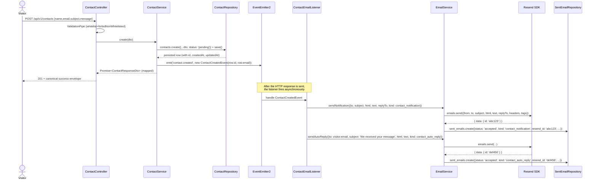

# Design: `domain-contact` — Contact domain (Resend-backed public form)

## 1. Title and metadata

| Field | Value |
| --- | --- |
| Change name | `domain-contact` |
| Branch | `domain/contact` (cut from `dev` at apply time) |
| Status | **designed** (2026-06-23) |
| Project | `roonder-portfolio-backend` (NestJS 11 + TypeORM 1.x + PostgreSQL/Supabase + JWT/passport + class-validator + Joi + Resend SDK + Swagger) |
| Artifact store | `openspec` (repo-local at `openspec/`) |
| Planning home | `openspec/changes/domain-contact/` |
| Strict TDD | ACTIVE (`openspec/config.yaml > rules.apply.tdd: true`) |
| Review budget | 400 changed lines per PR — **HIGH RISK** (forecast ≈ 4 200 LOC; see §13) |
| Chain strategy | **NOT YET SELECTED.** A logical slice boundary is proposed in §13; the user will choose between `stacked-to-main` and `feature-branch-chain` at `sdd-tasks`. |

## 2. Architecture overview

The contact module is the last domain to ship. It plugs into the existing **Screaming / Clean architecture** layout under `src/{auth,projects,reviews,contact,config,common,cli,database}` and mirrors the `reviews` domain exactly: a public write surface (`POST /api/v1/contacts`) under a per-IP throttler, a class-level JWT-guarded admin surface (`GET /api/v1/admin/contacts`, `PATCH /api/v1/admin/contacts/:id`), and two entities (`ContactEntity`, `SentEmailEntity`) registered with `TypeOrmModule.forFeature`. The **new** twist is a 3rd-party network integration: every persisted contact row triggers two Resend sends (operator notification + visitor auto-reply) through a single `EmailService` wrapper that wraps the SDK and writes one `sent_emails` row per attempt. The dispatch is decoupled from the HTTP request via NestJS `EventEmitter2`: `ContactService.create` persists, emits `ContactCreatedEvent`, and returns 201 immediately; an `@OnEvent` listener (`ContactEmailListener`) handles the dispatch asynchronously and **never** rethrows Resend failures back to the controller — the user-locked decision #7 ("never 5xx on Resend failure") is enforced here.

The cross-cutting layer (`src/main.ts`, `src/app.module.ts`, `src/config/env.config.ts`) absorbs the env-var additions (`RESEND_FROM_ADDRESS`, `RESEND_TO_ADDRESS`, `CONTACT_THROTTLE_*`) and the new `@nestjs/event-emitter` runtime dep. The global `AllExceptionsFilter` already renders the canonical 5-key error envelope; the success envelope is just the controller's natural return value (a DTO-mapped entity for single-row responses, `{ data, total, page, pageSize }` for paginated lists — the same shape the reviews change locked). The canonical "log of received emails" boolean (`contacts.email_sent_log`) is destructively dropped; the audit trail moves to a new `sent_emails` table (encoded in the database delta), which is the only structural change to the `contacts` row.

## 3. Component diagram

```mermaid
graph TD
	subgraph HTTP[Public HTTP]
		Client[Visitor browser / portfolio frontend]
	end

	subgraph AdminHTTP[Admin HTTP]
		AdminClient[Admin SPA — JWT bearer]
	end

	subgraph ContactModule[src/contact]
		ContactController[ContactController<br/>POST /api/v1/contacts<br/>@Throttle per-IP]
		ContactAdminController[ContactAdminController<br/>GET /api/v1/admin/contacts<br/>PATCH /api/v1/admin/contacts/:id<br/>@UseGuards JwtAuthGuard]
		ContactService[ContactService]
		ContactEmailListener[ContactEmailListener<br/>@OnEvent contact.created]
		EmailService[EmailService<br/>src/contact/email/]
		ContactMapper[contact.mapper.ts]
	end

	subgraph Common[src/common + src/auth]
		ThrottlerGuard[ThrottlerGuard<br/>per-route only]
		JwtAuthGuard[JwtAuthGuard]
		AllExceptionsFilter[AllExceptionsFilter<br/>5-key error envelope]
		Resend[(resend SDK v6.12.4<br/>node_modules)]
	end

	subgraph Persistence[PostgreSQL]
		ContactRepo[ContactRepository]
		SentEmailRepo[SentEmailRepository]
	end

	Client -->|JSON body| ContactController
	ContactController -->|@Throttle| ThrottlerGuard
	ContactController -->|create dto| ContactService
	ContactService -->|persist| ContactRepo
	ContactService -->|emit ContactCreatedEvent| ContactEmailListener
	ContactService -->|toContactResponse| ContactMapper
	ContactMapper -->|201 + DTO| ContactController
	ContactController -->|throw HttpException| AllExceptionsFilter

	ContactEmailListener -->|sendNotification| EmailService
	ContactEmailListener -->|sendAutoReply| EmailService
	EmailService -->|emails.send| Resend
	EmailService -->|write row| SentEmailRepo

	AdminClient -->|bearer| ContactAdminController
	ContactAdminController -->|@UseGuards| JwtAuthGuard
	ContactAdminController -->|list / update| ContactService
	ContactService -->|read / update| ContactRepo
```

## 4. Sequence diagrams

### 4.1 Public POST — happy path (Resend succeeds on both sends)



### 4.2 Public POST — Resend failure (one or both sends reject)

```mermaid
sequenceDiagram
	actor Client as Visitor
	participant Ctl as ContactController
	participant Svc as ContactService
	participant Repo as ContactRepository
	participant EE as EventEmitter2
	participant Lst as ContactEmailListener
	participant Em as EmailService
	participant R as Resend SDK
	participant SRepo as SentEmailRepository

	Client->>Ctl: POST /api/v1/contacts {name,email,subject,message}
	Ctl->>Svc: create(dto)
	Svc->>Repo: save (status: 'pending')
	Repo-->>Svc: persisted row
	Svc->>EE: emit('contact.created', ...)
	Svc-->>Ctl: DTO
	Ctl-->>Client: 201 + canonical success envelope

	EE->>Lst: handle event (async)
	Lst->>Em: sendNotification(...)
	Em->>R: emails.send(...)
	R-->>Em: { data: null, error: { name: 'invalid_from_address', message: '...', statusCode: 422 } }
	Em->>SRepo: sent_emails.create({status: 'failed', kind: 'contact_notification', resend_id: null, error_message: 'invalid_from_address: ...'})
	Note over Em: EmailService returns silently (no throw)
	Lst->>Em: sendAutoReply(...)
	Em->>R: emails.send(...)
	R-->>Em: { data: { id: 'ghi789' } }
	Em->>SRepo: sent_emails.create({status: 'accepted', kind: 'contact_auto_reply', resend_id: 'ghi789', ...})

	Note over Client: Client already received 201;<br/>global filter was NEVER invoked.
	Note over SRepo: Operator audits failures via<br/>SELECT * FROM sent_emails WHERE status = 'failed'
```

## 5. Module and file layout

> Legend: **[NEW]** = create, **[MOD]** = modify, **[DEL]** = delete. LOC estimates per file are in §13.

### 5.1 `src/contact/` (contact domain)

| File | Action | One-line purpose |
| --- | --- | --- |
| `src/contact/contact.controller.ts` | **[MOD]** | Replace 5-route scaffold with 1-route public controller (`POST /api/v1/contacts` with `@Throttle`, `@ApiTags`, `@ApiOperation`, `@ApiResponse` 201/400/429). |
| `src/contact/contact-admin.controller.ts` | **[NEW]** | 2-route admin controller (`GET /api/v1/admin/contacts`, `PATCH /api/v1/admin/contacts/:id`) with class-level `@UseGuards(JwtAuthGuard)` + `@ApiBearerAuth()`. Mirror `reviews-admin.controller.ts`. |
| `src/contact/contact.service.ts` | **[MOD]** | Replace placeholder methods with `create`, `findAllForAdmin`, `updateStatus` — emits `ContactCreatedEvent` after persist. |
| `src/contact/contact.module.ts` | **[MOD]** | Register `TypeOrmModule.forFeature([ContactEntity, SentEmailEntity])`, both controllers, `ContactService`, `EmailService`, `ContactEmailListener`. Provide `RESEND_CLIENT` injection token. |
| `src/contact/contact.mapper.ts` | **[NEW]** | `toContactResponse(row)` + `toSentEmailResponse(row)` pure-function mappers. |
| `src/contact/throttle.decorator.ts` | **[NEW]** | `ThrottledContactWrite()` factory reading `CONTACT_THROTTLE_*` env vars (mirrors `reviews/throttle.decorator.ts`). |
| `src/contact/contact.controller.spec.ts` | **[MOD]** | REPLACE smoke `toBeDefined` with supertest-driven HTTP shape + metadata assertions. |
| `src/contact/contact.service.spec.ts` | **[MOD]** | REPLACE smoke `toBeDefined` with create + emit + mapper + list + status-transition scenarios. |
| `src/contact/contact-admin.controller.spec.ts` | **[NEW]** | supertest-driven 401/200/404/400 admin paths + static metadata assertions (no `@Throttle()` on admin, class-level `@UseGuards`). |
| `src/contact/contact.module.spec.ts` | **[NEW]** | static `readFileSync` contract: `forFeature([ContactEntity, SentEmailEntity])`, both controllers, exports, no global guard. |
| `src/contact/throttle.decorator.spec.ts` | **[NEW]** | assert `ThrottledContactWrite()` returns `MethodDecorator`, binds `CONTACT_THROTTLE_*` env values. |
| `src/contact/dto/create-contact.dto.ts` | **[MOD]** | 4 fields (`name`, `email`, `subject`, `message`) with class-validator + `@ApiProperty`. |
| `src/contact/dto/create-contact.dto.spec.ts` | **[NEW]** | 10+ DTO validation scenarios (required, length bounds, email format, extra-field rejection). |
| `src/contact/dto/contact-response.dto.ts` | **[NEW]** | 7-field response DTO mirroring the entity (id, name, email, subject, message, status, createdAt, updatedAt). |
| `src/contact/dto/update-contact-status.dto.ts` | **[NEW]** | `{ status: 'pending' | 'read' | 'replied' }` PATCH body. |
| `src/contact/dto/update-contact-status.dto.spec.ts` | **[NEW]** | validation: status is required, must be one of the 3 values. |
| `src/contact/dto/list-contacts-query.dto.ts` | **[NEW]** | `?page&pageSize` for admin list (mirrors `ListReviewsQueryDto`). |
| `src/contact/dto/list-contacts-query.dto.spec.ts` | **[NEW]** | pagination transform + clamping. |
| `src/contact/dto/list-contacts-response.dto.ts` | **[NEW]** | `{ data, total, page, pageSize }` envelope. |
| `src/contact/entities/contact.entity.ts` | **[MOD]** | `@Entity('contacts')` mirroring the post-migration DBML (8 columns including `updated_at`, **no** `email_sent_log`). Snake-case via `@Column({ name })`. |
| `src/contact/entities/contact.entity.spec.ts` | **[NEW]** | metadata: 8 columns, snake-case mapping, `status` defaults to `'pending'`, `updatedAt` is `@UpdateDateColumn`, no `emailSentLog` column. |
| `src/contact/entities/sent-email.entity.ts` | **[NEW]** | `@Entity('sent_emails')` with 10 columns, 2 enums (`sent_emails_status_enum`, `sent_emails_kind_enum`), and `resend_id` nullable + partial unique. |
| `src/contact/entities/sent-email.entity.spec.ts` | **[NEW]** | metadata: 10 columns, 2 enums, snake-case mapping, `resend_id` nullable. |
| `src/contact/events/contact-created.event.ts` | **[NEW]** | `export class ContactCreatedEvent { constructor(public readonly contactId: string, public readonly recipientEmail: string) {} }`. |
| `src/contact/listeners/contact-email.listener.ts` | **[NEW]** | `@OnEvent('contact.created') handleContactCreated(event: ContactCreatedEvent)` — loads contact, calls `EmailService.sendNotification` + `sendAutoReply`. |
| `src/contact/listeners/contact-email.listener.spec.ts` | **[NEW]** | assert the listener invokes the EmailService twice with the right `kind`s and never rethrows on Resend failure. |
| `src/contact/email/email.service.ts` | **[NEW]** | The Resend wrapper (see §8). |
| `src/contact/email/email.service.spec.ts` | **[NEW]** | injected Resend client fake — `accepted`, `failed`, and one-fails-one-succeeds scenarios. |
| `src/contact/email/email-renderer.ts` | **[NEW]** | `renderContactNotificationHtml(row): string`, `renderContactNotificationText(row): string`, `renderContactAutoReplyHtml(row): string`, `renderContactAutoReplyText(row): string`. |
| `src/contact/email/email-renderer.spec.ts` | **[NEW]** | regex invariants: no `<style>`, no `display: flex|grid`, no `position: absolute|fixed`, no `@font-face`, plain-text always present, locked Spanish copy, locked subject. |
| `src/contact/email/email-template.ts` | **[NEW]** | The two HTML skeletons as exported string constants (one per `kind`). The renderers substitute placeholders. |

### 5.2 `src/database/migrations/`

| File | Action | One-line purpose |
| --- | --- | --- |
| `src/database/migrations/20260623HHMMSS-create-contacts-and-sent-emails.ts` | **[NEW]** | Hand-written reversible migration. `up` (1) drops `contacts.email_sent_log`, (2) adds `contacts.updated_at`, (3) creates `sent_emails_status_enum` + `sent_emails_kind_enum`, (4) creates `sent_emails` table with 10 columns + 4 indexes. `down` reverses in opposite order. See §6. |

### 5.3 `src/config/`

| File | Action | One-line purpose |
| --- | --- | --- |
| `src/config/env.config.ts` | **[MOD]** | Add `RESEND_FROM_ADDRESS: Joi.string().required()`, `RESEND_TO_ADDRESS: Joi.string().email().required()`, `CONTACT_THROTTLE_TTL_MS: Joi.number().integer().min(1_000).default(60_000)`, `CONTACT_THROTTLE_WRITE_LIMIT: Joi.number().integer().min(1).default(5)`, `CONTACT_THROTTLE_READ_LIMIT: Joi.number().integer().min(1).default(60)`. Extend the `EnvConfig` interface. |
| `src/config/env.config.spec.ts` | **[MOD]** | Add 6+ new scenarios (defaults, round-trip, floor rejection for each). |

### 5.4 `src/app.module.ts` & `src/main.ts`

| File | Action | One-line purpose |
| --- | --- | --- |
| `src/app.module.ts` | **[MOD]** | Import `EventEmitterModule` from `@nestjs/event-emitter` and add `EventEmitterModule.forRoot()` to `imports`. The `ThrottlerModule.forRootAsync` config also reads the contact throttler env vars in parallel (but uses the same `default` tracker; see §10). |
| `src/main.ts` | **[NO CHANGE]** | `trust proxy = 1` is already set; canonical envelope + Swagger + CORS setup unchanged. |

### 5.5 `src/data-source.ts`

| File | Action | One-line purpose |
| --- | --- | --- |
| `src/data-source.ts` | **[MOD]** | Add `ContactEntity` and `SentEmailEntity` to the `entities` array. Migration glob already covers the new file. |

### 5.6 `package.json` / `package-lock.json`

| File | Action | One-line purpose |
| --- | --- | --- |
| `package.json` | **[MOD]** | Add `"@nestjs/event-emitter": "^2.0.0"` (pin to the v2 line that's compatible with NestJS 11 — verified at apply time) to `dependencies`. |
| `package-lock.json` | **[MOD]** | Regenerated by `npm install` after the `package.json` edit. |

### 5.7 Repo root

| File | Action | One-line purpose |
| --- | --- | --- |
| `.env.example` | **[NEW]** | Placeholders for every env var in `EnvConfig` (mirroring `env.config.spec.ts`'s `baseValidEnv`), with the `# REEMPLAZAR CUANDO SE COMPRE EL DOMINIO` comment next to `RESEND_FROM_ADDRESS` + `RESEND_TO_ADDRESS`. |

### 5.8 E2E

| File | Action | One-line purpose |
| --- | --- | --- |
| `test/contact.e2e-spec.ts` | **[NEW]** | supertest: public POST happy path, validation 400, throttler 429, Resend-failure 201, e2e audit of `sent_emails` rows via the in-memory fake repos. |
| `test/contact-admin.e2e-spec.ts` | **[NEW]** | supertest: 401 on missing JWT, 200 on list, 200 on PATCH happy path, 404 on unknown id, 400 on non-uuid id. |

### 5.9 NOT in `src/common/`

The `EmailService` is **scoped to `src/contact/email/`** (not `src/common/email/`) per the locked proposal §4 + §5. Rationale: only the contact domain uses it today; lifting to `common/` would be speculative. If a future domain (e.g. comments moderation) needs to email, the wrapper can be moved up then.

## 6. Database migration

The migration is a single hand-written file mirroring the reviews/projects precedent (`CREATE TABLE`/`ALTER TABLE` raw SQL, `IF NOT EXISTS` safety nets on the `ALTER`s, no `DROP TABLE` in the `up`). Two `CREATE TYPE` statements precede the `sent_emails` table.

```ts
// src/database/migrations/20260623HHMMSS-create-contacts-and-sent-emails.ts
import { MigrationInterface, QueryRunner } from "typeorm";

export class CreateContactsAndSentEmails20260623 implements MigrationInterface {
	name = "CreateContactsAndSentEmails20260623";

	public async up(queryRunner: QueryRunner): Promise<void> {
		// --- contacts: drop the boolean audit, add updated_at ---
		await queryRunner.query(
			`ALTER TABLE "contacts" DROP COLUMN IF EXISTS "email_sent_log"`,
		);
		await queryRunner.query(
			`ALTER TABLE "contacts" ADD COLUMN IF NOT EXISTS "updated_at" TIMESTAMP NOT NULL DEFAULT now()`,
		);

		// --- sent_emails: enums first, then table, then indexes ---
		await queryRunner.query(
			`CREATE TYPE "sent_emails_status_enum" AS ENUM ('accepted', 'failed')`,
		);
		await queryRunner.query(
			`CREATE TYPE "sent_emails_kind_enum" AS ENUM ('contact_notification', 'contact_auto_reply')`,
		);
		await queryRunner.query(`
			CREATE TABLE "sent_emails" (
				"id" uuid NOT NULL DEFAULT uuid_generate_v4(),
				"subject" varchar NOT NULL,
				"from" varchar NOT NULL,
				"to" varchar NOT NULL,
				"resend_id" varchar,
				"status" "sent_emails_status_enum" NOT NULL,
				"kind" "sent_emails_kind_enum" NOT NULL,
				"error_message" text,
				"created_at" TIMESTAMP NOT NULL DEFAULT now(),
				"updated_at" TIMESTAMP NOT NULL DEFAULT now(),
				CONSTRAINT "PK_sent_emails" PRIMARY KEY ("id")
			)
		`);
		await queryRunner.query(
			`CREATE INDEX "idx_sent_emails_kind" ON "sent_emails" ("kind")`,
		);
		await queryRunner.query(
			`CREATE INDEX "idx_sent_emails_status" ON "sent_emails" ("status")`,
		);
		await queryRunner.query(
			`CREATE INDEX "idx_sent_emails_created_at_desc" ON "sent_emails" ("created_at" DESC)`,
		);
		await queryRunner.query(
			`CREATE UNIQUE INDEX "idx_sent_emails_resend_id_unique" ON "sent_emails" ("resend_id") WHERE "resend_id" IS NOT NULL`,
		);
	}

	public async down(queryRunner: QueryRunner): Promise<void> {
		await queryRunner.query(
			`DROP INDEX IF EXISTS "idx_sent_emails_resend_id_unique"`,
		);
		await queryRunner.query(
			`DROP INDEX IF EXISTS "idx_sent_emails_created_at_desc"`,
		);
		await queryRunner.query(
			`DROP INDEX IF EXISTS "idx_sent_emails_status"`,
		);
		await queryRunner.query(
			`DROP INDEX IF EXISTS "idx_sent_emails_kind"`,
		);
		await queryRunner.query(`DROP TABLE IF EXISTS "sent_emails"`);
		await queryRunner.query(`DROP TYPE IF EXISTS "sent_emails_kind_enum"`);
		await queryRunner.query(
			`DROP TYPE IF EXISTS "sent_emails_status_enum"`,
		);
		await queryRunner.query(
			`ALTER TABLE "contacts" DROP COLUMN IF EXISTS "updated_at"`,
		);
		await queryRunner.query(
			`ALTER TABLE "contacts" ADD COLUMN IF NOT EXISTS "email_sent_log" boolean NOT NULL DEFAULT true`,
		);
	}
}
```

**Notes:**
- `down` recreates the dropped `email_sent_log` column to keep the migration fully reversible (operator can revert without DBML loss).
- The `down` step that drops the `updated_at` column will lose the column data — but the pre-migration DB had no such data (this is an additive change), so no information is destroyed.
- `CREATE TYPE` statements are NOT wrapped in `IF NOT EXISTS` because Postgres has no native "create type if not exists" syntax. The `down` step's `DROP TYPE IF EXISTS` is the rollback path.
- The `IF NOT EXISTS` on `ADD COLUMN` makes the `up` re-runnable on a partially-failed migration. The `CREATE TABLE` is not idempotent (Postgres semantics) — the operator's dev re-apply path is `migration:revert` then `migration:run` (matches the reviews precedent).

## 7. Joi env schema additions

Extend `src/config/env.config.ts` (the `EnvConfig` interface + the `ENV_CONFIG` Joi object) with 5 new fields. Floors match the reviews precedent exactly.

```ts
// Additions to EnvConfig interface:
RESEND_FROM_ADDRESS: string;          // friendly-name form allowed
RESEND_TO_ADDRESS: string;            // must be a valid email
CONTACT_THROTTLE_TTL_MS: number;
CONTACT_THROTTLE_WRITE_LIMIT: number;
CONTACT_THROTTLE_READ_LIMIT: number;

// Additions to ENV_CONFIG (after the existing RESEND_API_KEY):
RESEND_FROM_ADDRESS: Joi.string().required(),
RESEND_TO_ADDRESS: Joi.string().email().required(),
CONTACT_THROTTLE_TTL_MS: Joi.number().integer().min(1_000).default(60_000),
CONTACT_THROTTLE_WRITE_LIMIT: Joi.number().integer().min(1).default(5),
CONTACT_THROTTLE_READ_LIMIT: Joi.number().integer().min(1).default(60),
```

**Why split FROM/TO validation:** Resend accepts a friendly-name form `Name <email@domain>` for the `from` field but a bare email for `to`. `Joi.string().email()` would reject the friendly-name form on `from`. The two validations are intentionally different.

**`disable` knob:** setting `CONTACT_THROTTLE_WRITE_LIMIT=1_000_000` is the documented escape hatch (matches reviews). It falls out of the `min(1)` floor; no separate "disable" field.

**Spec scenarios encoded as new `env.config.spec.ts` tests:**

1. Missing `RESEND_FROM_ADDRESS` → Joi error.
2. Missing `RESEND_TO_ADDRESS` → Joi error.
3. Malformed `RESEND_TO_ADDRESS` (e.g. `not-an-email`) → Joi error.
4. `RESEND_FROM_ADDRESS` in the friendly-name form → accepted.
5. `CONTACT_THROTTLE_TTL_MS=500` → rejected (floor).
6. `CONTACT_THROTTLE_WRITE_LIMIT=0` → rejected (floor).
7. Default round-trip when no contact env vars are set.

## 8. EmailService wrapper — class sketch

**Location:** `src/contact/email/email.service.ts` (under `contact/`, not `common/` — only the contact domain uses it today).

**Injection model:** a `RESEND_CLIENT` injection token (a `Symbol` or string) is registered as a provider in `ContactModule` via `useFactory` that calls `new Resend(config.get("RESEND_API_KEY"))`. The service depends on the token (not on `ConfigService`) so unit tests can pass a fake without booting the config layer.

```ts
// src/contact/email/email.service.ts
import { Inject, Injectable, Logger } from "@nestjs/common";
import type { Resend } from "resend";
import { InjectRepository } from "@nestjs/typeorm";
import { Repository } from "typeorm";
import { SentEmailEntity } from "../entities/sent-email.entity";
import { ContactEntity } from "../entities/contact.entity";
import {
	renderContactNotificationHtml,
	renderContactNotificationText,
	renderContactAutoReplyHtml,
	renderContactAutoReplyText,
} from "./email-renderer";
import { RESEND_CLIENT } from "./resend-client.token";

export const SENT_EMAIL_KIND = {
	CONTACT_NOTIFICATION: "contact_notification",
	CONTACT_AUTO_REPLY: "contact_auto_reply",
} as const;
export type SentEmailKind = (typeof SENT_EMAIL_KIND)[keyof typeof SENT_EMAIL_KIND];

export const SENT_EMAIL_STATUS = {
	ACCEPTED: "accepted",
	FAILED: "failed",
} as const;
export type SentEmailStatus =
	(typeof SENT_EMAIL_STATUS)[keyof typeof SENT_EMAIL_STATUS];

export interface SendEmailInput {
	from: string;
	to: string;
	subject: string;
	html: string;
	text: string;
	replyTo?: string;
	headers?: Record<string, string>;
	kind: SentEmailKind;
}

@Injectable()
export class EmailService {
	private readonly logger = new Logger(EmailService.name);
	constructor(
		@Inject(RESEND_CLIENT) private readonly resend: Resend,
		@InjectRepository(SentEmailEntity)
		private readonly sentEmails: Repository<SentEmailEntity>,
	) {}

	async sendContactNotification(contact: ContactEntity): Promise<void> {
		await this.send({
			from: process.env["RESEND_FROM_ADDRESS"]!, // validated at boot
			to: process.env["RESEND_TO_ADDRESS"]!,
			subject: `New contact form submission: ${contact.subject}`,
			html: renderContactNotificationHtml(contact),
			text: renderContactNotificationText(contact),
			replyTo: contact.email,
			headers: { "X-Contact-Id": contact.id },
			kind: SENT_EMAIL_KIND.CONTACT_NOTIFICATION,
		});
	}

	async sendContactAutoReply(contact: ContactEntity): Promise<void> {
		await this.send({
			from: process.env["RESEND_FROM_ADDRESS"]!,
			to: contact.email,
			subject: "We received your message",
			html: renderContactAutoReplyHtml(contact),
			text: renderContactAutoReplyText(contact),
			kind: SENT_EMAIL_KIND.CONTACT_AUTO_REPLY,
		});
	}

	/** Never throws. Always writes a sent_emails row. */
	private async send(input: SendEmailInput): Promise<void> {
		try {
			const { data, error } = await this.resend.emails.send({
				from: input.from,
				to: [input.to],
				subject: input.subject,
				html: input.html,
				text: input.text,
				replyTo: input.replyTo,
				headers: input.headers,
				tags: [{ name: "domain", value: "contact-form" }],
			});
			if (error || !data) {
				await this.sentEmails.save(
					this.sentEmails.create({
						subject: input.subject,
						from: input.from,
						to: input.to,
						resendId: null,
						status: SENT_EMAIL_STATUS.FAILED,
						kind: input.kind,
						errorMessage: error?.message ?? "unknown Resend error",
					}),
				);
				return;
			}
			await this.sentEmails.save(
				this.sentEmails.create({
					subject: input.subject,
					from: input.from,
					to: input.to,
					resendId: data.id,
					status: SENT_EMAIL_STATUS.ACCEPTED,
					kind: input.kind,
					errorMessage: null,
				}),
			);
		} catch (e) {
			// Defensive: the SDK normally resolves with { data, error };
			// a thrown exception here is a network or runtime error.
			const message = (e as Error)?.message ?? "unknown";
			await this.sentEmails.save(
				this.sentEmails.create({
					subject: input.subject,
					from: input.from,
					to: input.to,
					resendId: null,
					status: SENT_EMAIL_STATUS.FAILED,
					kind: input.kind,
					errorMessage: message,
				}),
			);
			this.logger.error(`Email send threw: ${message}`);
		}
	}
}
```

The injection token (`RESEND_CLIENT`) lives in `src/contact/email/resend-client.token.ts`:

```ts
export const RESEND_CLIENT = Symbol("RESEND_CLIENT");
```

The factory in `ContactModule`:

```ts
{
	provide: RESEND_CLIENT,
	inject: [ConfigService],
	useFactory: (config: ConfigService<EnvConfig>) =>
		new Resend(config.get("RESEND_API_KEY", { infer: true }) as string),
},
```

## 9. Event flow

### 9.1 The event

```ts
// src/contact/events/contact-created.event.ts
export class ContactCreatedEvent {
	constructor(
		public readonly contactId: string,
		public readonly recipientEmail: string,
	) {}
}
```

The event is intentionally minimal — just the id (so the listener can `findOne` the row fresh and get the latest persisted state) and the recipient email (so the listener doesn't need to re-read the row to know where to send the auto-reply). The listener always re-reads the row in case anything changed between `create` and the async dispatch (e.g. the admin ran a PATCH in the milliseconds between; the listener should send to the visitor's CURRENT row, not the snapshot).

### 9.2 The listener

```ts
// src/contact/listeners/contact-email.listener.ts
import { Injectable, Logger } from "@nestjs/common";
import { OnEvent } from "@nestjs/event-emitter";
import { InjectRepository } from "@nestjs/typeorm";
import { Repository } from "typeorm";
import { ContactEntity } from "../entities/contact.entity";
import { EmailService } from "../email/email.service";
import { ContactCreatedEvent } from "../events/contact-created.event";

@Injectable()
export class ContactEmailListener {
	private readonly logger = new Logger(ContactEmailListener.name);
	constructor(
		@InjectRepository(ContactEntity)
		private readonly contacts: Repository<ContactEntity>,
		private readonly emailService: EmailService,
	) {}

	@OnEvent("contact.created", { async: true })
	async handleContactCreated(event: ContactCreatedEvent): Promise<void> {
		const row = await this.contacts.findOne({
			where: { id: event.contactId },
		});
		if (!row) {
			// The row was deleted between create and dispatch — log and
			// bail. No email sent. This is the only case where the
			// listener does NOT trigger both sends.
			this.logger.warn(
				`ContactCreatedEvent for missing id=${event.contactId}; skipping dispatch.`,
			);
			return;
		}
		// Two independent sends. EmailService.sendContactNotification
		// and sendContactAutoReply are themselves non-throwing (they
		// always write a sent_emails row). The pair is sequential;
		// if the spec ever demands parallelism, the two awaits can
		// become Promise.all without changing the public contract.
		await this.emailService.sendContactNotification(row);
		await this.emailService.sendContactAutoReply(row);
	}
}
```

The `ContactService.create` emits the event with `this.eventEmitter.emit('contact.created', new ContactCreatedEvent(saved.id, saved.email))`. `EventEmitter2` is injected into the service constructor. Because the listener is decorated with `@OnEvent('contact.created', { async: true })`, the event is dispatched asynchronously — the HTTP request returns 201 before the listener runs.

## 10. Throttler registration

The reviews precedent uses a per-route decorator factory plus a `ThrottlerModule.forRootAsync` in `AppModule`. The contact domain mirrors it exactly.

### 10.1 Per-route decorator (`src/contact/throttle.decorator.ts`)

```ts
import { Throttle } from "@nestjs/throttler";

export function ThrottledContactWrite(): MethodDecorator {
	const limit = Number(process.env["CONTACT_THROTTLE_WRITE_LIMIT"] ?? 5);
	const ttl = Number(process.env["CONTACT_THROTTLE_TTL_MS"] ?? 60_000);
	return Throttle({ default: { limit, ttl } });
}
```

(The `READ_LIMIT` is registered as an env var for forward-compat — there are no public reads to throttle today, but if a public `GET /api/v1/contacts/:id` route is added later, the env-var naming is already consistent.)

### 10.2 Module-level registration

`ContactModule` does NOT register `ThrottlerModule.forRoot()` — the single registration is in `AppModule`. The only `AppModule` change needed is to add `CONTACT_THROTTLE_*` reads to the existing `ThrottlerModule.forRootAsync` factory so the "default" tracker is sized for the contact throttler (which is the smaller and more conservative of the two domain limits):

```ts
// src/app.module.ts — ThrottlerModule.forRootAsync (modified)
ThrottlerModule.forRootAsync({
	inject: [ConfigService],
	useFactory: (config: ConfigService<EnvConfig>) => {
		// The "default" tracker is the smaller of the two domain
		// write limits so an operator who forgets to set a
		// domain-specific env var still gets a safe default.
		// Per-route @Throttle() on the reviews and contact public
		// routes OVERRIDES this with the domain-specific limit.
		const contactTtl = config.get("CONTACT_THROTTLE_TTL_MS", {
			infer: true,
		}) as number;
		const contactWriteLimit = config.get(
			"CONTACT_THROTTLE_WRITE_LIMIT",
			{ infer: true },
		) as number;
		const reviewsTtl = config.get("REVIEWS_THROTTLE_TTL_MS", {
			infer: true,
		}) as number;
		const reviewsWriteLimit = config.get("REVIEWS_THROTTLE_WRITE_LIMIT", {
			infer: true,
		}) as number;
		const ttl = Math.min(contactTtl, reviewsTtl);
		const limit = Math.min(contactWriteLimit, reviewsWriteLimit);
		return [{ name: "default", ttl, limit }];
	},
}),
```

The per-route `@ThrottledContactWrite()` on the public POST and `@ThrottledWrite()` on the public reviews POST each override the `default` tracker. The admin routes carry no `@Throttle()` decorator (verified by the static metadata assertions in both admin controller specs).

### 10.3 IP resolution

`app.set("trust proxy", 1)` is set globally in `src/main.ts`. The throttler reads `req.ip`, which Express resolves via the single-hop trust. No new code is required in this change; the contact throttler inherits the project-wide invariant.

## 11. Response envelope integration

The project has **no global success interceptor**. The canonical success shape is just the controller's return value, shaped by the service:

- **Single-object responses** (POST 201, PATCH 200): the service returns the response DTO directly (via `toContactResponse(row)`). The controller returns the same object; Nest serialises it as JSON. No wrapping. The shape is `{ id, name, email, subject, message, status, createdAt, updatedAt }`.
- **Paginated list responses** (GET 200): the service returns `{ data, total, page, pageSize }` (the `ListContactsResult` interface). The controller returns the same object.
- **Error responses** (4xx/5xx): the global `AllExceptionsFilter` (already wired in `src/main.ts`) renders the 5-key envelope `{ statusCode, error, message, timestamp, path }`. The 429 from the throttler falls under this filter with `error: "Too Many Requests"` (the `STATUS_LABELS[429]` entry). The `Retry-After` header is set by the throttler before the filter sees the response and is preserved because the filter does not touch `res.setHeader` / `res.getHeader`.

**No new success interceptor is proposed.** The reviewers-domain ADR explicitly rejected one (the success shape is decided by the response DTO + the mapper, not by a generic wrapper). The contact domain follows the same convention.

The mapper (`contact.mapper.ts`) is the single point where the success shape is decided. The DTO classes (`ContactResponseDto`, `ListContactsResponseDto`, etc.) declare the same field set via `@ApiProperty` so the structural contract is identical and the runtime values are assignment-compatible.

## 12. Vanilla email template

The two HTML bodies are exported as string constants in `src/contact/email/email-template.ts`. Both are XHTML 1.0 Transitional, table-based, inline-styled, with no `<style>` block, no `display: flex/grid`, no `position: absolute/fixed`, no `@font-face`, no `vh/vw`, no `transform/transition/animation`. The preheader (when present) is the only `display: none` use.

### 12.1 Owner notification (sent to `RESEND_TO_ADDRESS`)

```ts
export const CONTACT_NOTIFICATION_HTML = `<!DOCTYPE html PUBLIC "-//W3C//DTD XHTML 1.0 Transitional//EN" "http://www.w3.org/TR/xhtml1/DTD/xhtml1-transitional.dtd">
<html xmlns="http://www.w3.org/1999/xhtml" lang="en">
	<head>
		<meta http-equiv="Content-Type" content="text/html; charset=UTF-8" />
		<meta name="viewport" content="width=device-width, initial-scale=1.0" />
		<title>New contact form submission</title>
	</head>
	<body style="margin:0;padding:0;background-color:#f5f5f5;font-family:Arial,Helvetica,sans-serif;color:#222;">
		<table role="presentation" width="100%" border="0" cellpadding="0" cellspacing="0" style="background-color:#f5f5f5;">
			<tr>
				<td align="center" style="padding:24px 12px;">
					<table role="presentation" width="600" border="0" cellpadding="0" cellspacing="0" style="max-width:600px;width:100%;background-color:#ffffff;border:1px solid #e5e5e5;">
						<tr>
							<td style="padding:24px 24px 8px 24px;">
								<h1 style="margin:0 0 16px 0;font-size:20px;line-height:24px;font-weight:bold;color:#111;">New contact form submission</h1>
								<p style="margin:0 0 12px 0;font-size:14px;line-height:20px;"><strong>From:</strong> {{name}} &lt;{{email}}&gt;</p>
								<p style="margin:0 0 12px 0;font-size:14px;line-height:20px;"><strong>Subject:</strong> {{subject}}</p>
								<p style="margin:16px 0 0 0;font-size:14px;line-height:20px;white-space:pre-wrap;">{{message}}</p>
							</td>
						</tr>
						<tr>
							<td style="padding:8px 24px 24px 24px;border-top:1px solid #e5e5e5;">
								<p style="margin:0;font-size:12px;line-height:16px;color:#666;">Submitted via the portfolio contact form. Reply directly to this email to respond to {{name}}.</p>
							</td>
						</tr>
					</table>
				</td>
			</tr>
		</table>
	</body>
</html>`;
```

### 12.2 Visitor auto-reply (sent to the submitter's email)

```ts
export const CONTACT_AUTO_REPLY_HTML = `<!DOCTYPE html PUBLIC "-//W3C//DTD XHTML 1.0 Transitional//EN" "http://www.w3.org/TR/xhtml1/DTD/xhtml1-transitional.dtd">
<html xmlns="http://www.w3.org/1999/xhtml" lang="en">
	<head>
		<meta http-equiv="Content-Type" text="text/html; charset=UTF-8" />
		<meta name="viewport" content="width=device-width, initial-scale=1.0" />
		<title>We received your message</title>
	</head>
	<body style="margin:0;padding:0;background-color:#f5f5f5;font-family:Arial,Helvetica,sans-serif;color:#222;">
		<table role="presentation" width="100%" border="0" cellpadding="0" cellspacing="0" style="background-color:#f5f5f5;">
			<tr>
				<td align="center" style="padding:24px 12px;">
					<table role="presentation" width="600" border="0" cellpadding="0" cellspacing="0" style="max-width:600px;width:100%;background-color:#ffffff;border:1px solid #e5e5e5;">
						<tr>
							<td style="padding:24px 24px 8px 24px;">
								<h1 style="margin:0 0 16px 0;font-size:20px;line-height:24px;font-weight:bold;color:#111;">We received your message</h1>
								<p style="margin:0 0 12px 0;font-size:14px;line-height:20px;">Hi {{name}},</p>
								<p style="margin:0 0 12px 0;font-size:14px;line-height:20px;">Recibimos tu mensaje, te contactaremos por email en breve.</p>
							</td>
						</tr>
					</table>
				</td>
			</tr>
		</table>
	</body>
</html>`;
```

### 12.3 Plain-text fallbacks (always present, 4–8 lines)

```ts
export const CONTACT_NOTIFICATION_TEXT = `New contact form submission

From:    {{name}} <{{email}}>
Subject: {{subject}}

{{message}}

---
Submitted via the portfolio contact form.
Reply directly to this email to respond to {{name}}.`;

export const CONTACT_AUTO_REPLY_TEXT = `We received your message

Hi {{name}},

Recibimos tu mensaje, te contactaremos por email en breve.

---
Roonder Portfolio`;
```

### 12.4 The renderers

`src/contact/email/email-renderer.ts` exports 4 pure functions that do the `{{placeholder}}` substitution. The unit spec (`email-renderer.spec.ts`) asserts the regex invariants from the contact spec:

- The rendered string MUST NOT match `/<style\b/i` (no `<style>` block).
- The rendered string MUST NOT contain the substrings `display: flex`, `display: grid`, `position: absolute`, `position: fixed`, `@font-face`.
- The plain-text variant MUST be a non-empty string (not the Resend auto-generated fallback).
- The auto-reply plain-text MUST contain the literal Spanish phrase `Recibimos tu mensaje, te contactaremos por email en breve.`
- The owner-notification subject (asserted in `EmailService` spec) MUST equal the literal `New contact form submission: <subject>`.

These are pure-function assertions, no DB, no Resend. The TDD contract is locked at the renderer boundary.

## 13. LOC forecast per component

Honest estimate, in line with the project's `*.spec.ts`-colocation style. **LOC = production code + tests, not counting `package-lock.json` (auto-generated) or empty scaffold deletions.**

| Component | File | LOC (est.) |
| --- | --- | ---: |
| Contact entity (replaces 1-LOC stub) | `src/contact/entities/contact.entity.ts` | 80 |
| Contact entity spec | `src/contact/entities/contact.entity.spec.ts` | 120 |
| SentEmail entity | `src/contact/entities/sent-email.entity.ts` | 110 |
| SentEmail entity spec | `src/contact/entities/sent-email.entity.spec.ts` | 100 |
| CreateContactDto | `src/contact/dto/create-contact.dto.ts` | 50 |
| CreateContactDto spec | `src/contact/dto/create-contact.dto.spec.ts` | 110 |
| ListContactsQueryDto | `src/contact/dto/list-contacts-query.dto.ts` | 40 |
| ListContactsQueryDto spec | `src/contact/dto/list-contacts-query.dto.spec.ts` | 50 |
| ListContactsResponseDto | `src/contact/dto/list-contacts-response.dto.ts` | 35 |
| ContactResponseDto | `src/contact/dto/contact-response.dto.ts` | 45 |
| UpdateContactStatusDto | `src/contact/dto/update-contact-status.dto.ts` | 35 |
| UpdateContactStatusDto spec | `src/contact/dto/update-contact-status.dto.spec.ts` | 50 |
| Contact mapper | `src/contact/contact.mapper.ts` | 50 |
| ContactService (replace 26-LOC stub) | `src/contact/contact.service.ts` | 150 |
| ContactService spec (replace 18-LOC stub) | `src/contact/contact.service.spec.ts` | 400 |
| ContactController (replace 45-LOC stub) | `src/contact/contact.controller.ts` | 80 |
| ContactController spec (replace 20-LOC stub) | `src/contact/contact.controller.spec.ts` | 280 |
| ContactAdminController | `src/contact/contact-admin.controller.ts` | 110 |
| ContactAdminController spec | `src/contact/contact-admin.controller.spec.ts` | 250 |
| Throttle decorator | `src/contact/throttle.decorator.ts` | 45 |
| Throttle decorator spec | `src/contact/throttle.decorator.spec.ts` | 100 |
| ContactEvent | `src/contact/events/contact-created.event.ts` | 25 |
| ContactEmailListener | `src/contact/listeners/contact-email.listener.ts` | 130 |
| ContactEmailListener spec | `src/contact/listeners/contact-email.listener.spec.ts` | 250 |
| ContactModule (replace 9-LOC stub) | `src/contact/contact.module.ts` | 55 |
| ContactModule spec | `src/contact/contact.module.spec.ts` | 50 |
| EmailService | `src/contact/email/email.service.ts` | 140 |
| EmailService spec | `src/contact/email/email.service.spec.ts` | 300 |
| Email renderer | `src/contact/email/email-renderer.ts` | 90 |
| Email renderer spec | `src/contact/email/email-renderer.spec.ts` | 200 |
| Email template constants | `src/contact/email/email-template.ts` | 130 |
| Resend injection token | `src/contact/email/resend-client.token.ts` | 8 |
| Migration | `src/database/migrations/20260623…ts` | 120 |
| Env config (modify) | `src/config/env.config.ts` | +30 |
| Env config spec (modify) | `src/config/env.config.spec.ts` | +60 |
| AppModule (modify) | `src/app.module.ts` | +15 |
| DataSource (modify) | `src/data-source.ts` | +10 |
| `package.json` (modify) | `package.json` | +1 |
| `.env.example` (CREATE) | `.env.example` | 30 |
| Contact e2e | `test/contact.e2e-spec.ts` | 400 |
| Contact-admin e2e | `test/contact-admin.e2e-spec.ts` | 280 |
| **TOTAL (new + modified LOC, all of it)** | | **≈ 4 220** |

**Budget vs forecast:**

| Metric | Value |
| --- | --- |
| 400-line review budget | 400 LOC |
| Forecast LOC | **≈ 4 220** |
| Ratio | **10.5× the budget** |

### 13.1 PR budget recommendation

**RECOMMENDATION: `chained-pr`.**

This is roughly 10× the per-PR soft cap. No realistic slice can land in a single PR without:

1. Sacrificing TDD coverage (forbidden by `rules.apply.tdd: true`).
2. Bundling the migration, the entity changes, the new env-var wiring, the new dependency, the email pipeline, and the admin endpoints in one review — defeating the purpose of the budget.

A `size-exception` would be the wrong answer: the user has not pre-authorized it, the spec calls this out as `HIGH RISK`, and the reviews-domain established the chainable pattern. A `scope-trim` would also be wrong: every scope item is locked by a user decision (proposal §6) and dropping the admin endpoints or the `sent_emails` table would invalidate the spec.

### 13.2 Logical slice boundary (proposed — user chooses strategy at `sdd-tasks`)

A clean 5-slice chain strategy (each slice reviewable in ~60 min):

| Slice | Theme | Approx LOC | Includes |
| --- | --- | ---: | --- |
| **S1 — foundations** | Entities, DTOs, migration, Joi env schema, `.env.example`, `EventEmitterModule` wiring, AppModule + DataSource updates, contact module scaffold (no event listener, no email). | ~950 | Everything except `EmailService`, the listener, the e2e. Lands `POST /api/v1/contacts` returning 201 with a stub listener that does nothing. Spec coverage is the DTO + entity + module + migration tests. |
| **S2 — throttler + admin** | `ThrottledContactWrite` decorator, `ContactAdminController` + spec, `findAllForAdmin` + `updateStatus` service methods + spec, `GET /api/v1/admin/contacts` + `PATCH /api/v1/admin/contacts/:id` e2e. | ~700 | The admin surface lands as a clean diff after the foundations. |
| **S3 — Resend client + EmailService** | `RESEND_CLIENT` token, `EmailService` wrapper, `SentEmailEntity` already landed in S1, the `sendContactNotification` + `sendContactAutoReply` methods, the `accepted` / `failed` row-write paths, `EmailService` spec. | ~620 | The wrapper is testable in isolation with a fake `Resend`. |
| **S4 — email template + renderer** | `email-template.ts` HTML + text constants, `email-renderer.ts` substitution, the regex-invariant spec. | ~420 | Pure functions, no DI, no Resend. |
| **S5 — event listener + public e2e** | `ContactCreatedEvent`, `ContactEmailListener` (`@OnEvent`), public e2e (`test/contact.e2e-spec.ts`) covering happy path + validation 400 + throttler 429 + Resend-failure 201. | ~960 | The last piece; glues S1+S3+S4 together. |
| **TOTAL** | | **≈ 4 220** | Each slice is ≈ 1 000 LOC including tests. |

The two chain strategies that fit:

- **`stacked-to-main`**: each slice is a branch off `domain/contact` and merges directly into `dev`/`main` in order. Simpler; the merge order is enforced by the DAG.
- **`feature-branch-chain`**: a tracker branch `domain/contact-tracker` is the merge target. S1 → `domain/contact-s1` targets `tracker`, S2 → `domain/contact-s2` targets S1, etc. The tracker PR stays open until S5 merges.

`sdd-tasks` will surface this choice to the user via the ask-always delivery strategy.

## 14. Test strategy

The project's strict TDD mode is ACTIVE. Every test below is **red** before implementation, **green** after. The existing 2 `*.spec.ts` smoke files in `src/contact/` are **REPLACED**, not extended, per proposal §4. The replace is in the S1 commit and is itself a TDD step (delete the smoke files, write the real spec, see it fail until the production code lands).

### 14.1 Unit tests (colocated `*.spec.ts` inside `src/`)

| File | What it tests | Approach |
| --- | --- | --- |
| `src/contact/entities/contact.entity.spec.ts` | Metadata: 8 columns including `updated_at`, snake-case mapping, `status` defaults to `'pending'`, `updatedAt` is `@UpdateDateColumn`, **no `emailSentLog` column**. | Static metadata inspection via `getMetadataArgsStorage()` (mirrors `review.entity.spec.ts`). |
| `src/contact/entities/sent-email.entity.spec.ts` | Metadata: 10 columns, 2 enums, snake-case mapping, `resend_id` nullable, no FK to `contacts` (the table is audit-only, not relationally linked — keeps the listener's `findOne` cheap). | Same static-metadata approach. |
| `src/contact/dto/create-contact.dto.spec.ts` | 10+ scenarios: accepts valid body; rejects missing `name`/`email`/`subject`/`message`; rejects bad email; rejects `name > 100`, `subject > 150`, `message > 5000`; rejects extra fields (`phone`, `company`, `attachments`); rejects empty strings. | `class-validator` `validate()` with `plainToInstance` (mirrors `create-review.dto.spec.ts`). |
| `src/contact/dto/list-contacts-query.dto.spec.ts` | Pagination transform: `?page=2&pageSize=5` parses; defaults are a service concern. | `class-transformer` mirror. |
| `src/contact/dto/update-contact-status.dto.spec.ts` | `status` is required and must be one of `'pending'`, `'read'`, `'replied'`. | `class-validator` mirror. |
| `src/contact/contact.service.spec.ts` | `create(dto)` persists with `status: 'pending'`, emits `ContactCreatedEvent`, returns the response DTO. `findAllForAdmin` paginates + orders by `created_at DESC`. `updateStatus` transitions; 404 on missing id. | `getRepositoryToken` fake + an `EventEmitter2` fake. |
| `src/contact/contact.controller.spec.ts` | HTTP shape: 201 with envelope on valid body; 400 on missing field; 400 on extra field; metadata: route has `@Throttle` (not `@UseGuards`); response shape matches DTO. | `supertest` + `Test.createTestingModule` with a service fake + repository token fakes + a disabled throttler (1 000 000 limit). Mirrors `reviews.controller.spec.ts`. |
| `src/contact/contact-admin.controller.spec.ts` | HTTP shape: 401 on missing JWT (via `StubJwtAuthGuard`); 200 + paginated envelope on GET; 200 on valid PATCH; 404 on unknown id; 400 on non-uuid id; metadata: NO `@Throttle()` on either admin route. | `supertest` + service fake + stub JWT guard. Mirrors `reviews-admin.controller.spec.ts`. |
| `src/contact/throttle.decorator.spec.ts` | `ThrottledContactWrite()` returns a `MethodDecorator`; binds `CONTACT_THROTTLE_*` env values at decoration time. | Pure-function spec. |
| `src/contact/listeners/contact-email.listener.spec.ts` | Listener fires on `ContactCreatedEvent`; calls `EmailService.sendContactNotification` + `sendContactAutoReply` with the right arguments; if the contact row is missing, logs a warning and skips without throwing. | `EventEmitter2` fake + contact repo fake + EmailService fake. |
| `src/contact/email/email.service.spec.ts` | `accepted` row when Resend returns `{ data: { id } }`; `failed` row when Resend returns `{ data: null, error }`; `failed` row when Resend throws (network); `error_message` populated; `resend_id` null on failure; `kind` matches the input. | Fake `Resend` client (constructor-injected via `RESEND_CLIENT` token) + in-memory `SentEmail` repo fake. |
| `src/contact/email/email-renderer.spec.ts` | Regex invariants: no `<style>`, no `display: flex|grid`, no `position: absolute|fixed`, no `@font-face`; `text` field always present and non-empty; auto-reply contains the literal Spanish phrase; placeholder substitution works. | Pure-function assertions on the rendered strings. |
| `src/contact/contact.module.spec.ts` | Static contract: `TypeOrmModule.forFeature([ContactEntity, SentEmailEntity])`, both controllers, `ContactService` + `EmailService` + `ContactEmailListener` provided, `RESEND_CLIENT` factory present. | `readFileSync` source-file inspection. Mirrors `reviews.module.spec.ts`. |
| `src/config/env.config.spec.ts` (modified) | 7 new scenarios: missing `RESEND_FROM_ADDRESS` → Joi error; missing `RESEND_TO_ADDRESS` → Joi error; bad `RESEND_TO_ADDRESS` → Joi error; `RESEND_FROM_ADDRESS` in friendly-name form accepted; `CONTACT_THROTTLE_TTL_MS=500` rejected; `CONTACT_THROTTLE_WRITE_LIMIT=0` rejected; default round-trip. | `ENV_CONFIG.validate({...})` direct calls. |

### 14.2 E2E tests (`test/`)

| File | What it covers | Approach |
| --- | --- | --- |
| `test/contact.e2e-spec.ts` | Public POST happy path (201 + envelope + DB row + 2 `sent_emails` rows via in-memory fake repos); 400 on missing field; 400 on bad email; 400 on extra field (`phone`); 429 on the 6th request with the throttler enabled (CONTACT_THROTTLE_WRITE_LIMIT=5); **Resend failure → 201, 2 `failed` `sent_emails` rows, `error_message` populated, NO 5xx, no global filter invocation**. | `supertest` + `Test.createTestingModule` with the full app composition (mirroring `test/reviews.e2e-spec.ts`), in-memory `Contact` + `SentEmail` repos, an injected `Resend` fake (via the `RESEND_CLIENT` token). |
| `test/contact-admin.e2e-spec.ts` | GET 401 on missing JWT; GET 200 on valid JWT (paginated envelope); PATCH 200 on valid `{ status: 'read' }`; PATCH 404 on unknown id; PATCH 400 on non-uuid id. | Same composition; flip throttler to permissive (1 000 000) for the admin paths. |

The existing 3 e2e files (`auth.e2e-spec.ts`, `projects.e2e-spec.ts`, `reviews.e2e-spec.ts`) should NOT be touched by this change. `test/reviews.e2e-spec.ts` already imports `ContactModule` (line 60) — but the new contact e2e files build a parallel app composition to avoid coupling the contact e2e to the reviews fixture.

### 14.3 What is NOT tested in this change

- A live Resend send (the project has no verified sender domain yet; the e2e uses the injected fake).
- Real email-client rendering (Gmail, Outlook for Windows, Apple Mail). The renderer is unit-tested for the structural invariants, but a Litmus / Email-on-Acid pass is a future follow-up.
- A live Postgres migration. The migration is hand-written; the `docker run … typeorm schema:log` verification path is referenced in the migration's own header comment (mirrors the reviews precedent).

## 15. Migration & deployment notes

- **Destructive DBML delta — `email_sent_log` is removed.** The `up` migration drops the column; the `down` migration recreates it. The user has pre-authorized this on 2026-06-23 (proposal §6, decision #2). The `sdd-archive` step will sync the `database-schema.dbml` lines 58–67 to the post-migration shape and warn before merge.
- **`@nestjs/event-emitter` is a runtime dep.** The `package.json` edit adds `"@nestjs/event-emitter": "^2.0.0"` (pin verified at apply time against the NestJS 11 compat matrix). `package-lock.json` regenerates on `npm install`. The verify step MUST rebuild the lockfile cleanly.
- **Resend sender domain is a deployment gate.** Resend will refuse to send from an unverified `from` address. The `.env.example` placeholders carry the `# REEMPLAZAR CUANDO SE COMPRE EL DOMINIO` comment. Local + staging work with a Resend test key (`re_test`); production deploy is **BLOCKED** until the operator verifies the sending domain in the Resend dashboard and updates `RESEND_FROM_ADDRESS` to the verified friendly-name form. This is a deployment gate, not a code change.
- **`trust proxy = 1` is already set globally** (`src/main.ts:33-36`); the contact throttler inherits it. No new code is required in `src/main.ts`.
- **The 2 pre-existing smoke-only `*.spec.ts` files** (`contact.controller.spec.ts`, `contact.service.spec.ts`) are **REPLACED, not extended**, in the S1 commit. Apply must not "keep" the smoke files for backward compat.

## 16. Risks and mitigations

| Risk | Likelihood | Impact | Mitigation |
| --- | --- | --- | --- |
| 400-line PR budget exceeded by ~10× | **Certain** | High — review will be skipped or shallow | **Chained PRs** (5 slices, see §13.2). The slice boundary is the chain strategy the user will pick at `sdd-tasks`. |
| Admin endpoints add LOC to S2 (~700) | High | Medium | S2 is its own slice; reviewer focus is admin surface only. |
| `@nestjs/event-emitter` install on top of active `dev` branch | Low | Low | Pin the version; `npm install` regenerates the lockfile. S1 includes the install step in the same commit. |
| Vanilla email not validated in real mailbox (no Litmus pass) | Medium | Medium — Outlook may render with quirks | The unit spec asserts the structural invariants (`<style>`, `display: flex`, etc.) so regressions are caught at the renderer. Manual send to Gmail + Outlook is a verify-phase checklist. |
| Resend sender domain not yet verified | **High (until verified)** | High — production sends 422 | The `.env.example` comment is the only in-code signal; the operator checklist at deploy time is the gate. |
| Destructive DBML delta — `email_sent_log` drop | Medium | Medium | User pre-authorized; the `down` migration is reversible. The `sdd-archive` step warns before merging the DBML delta. |
| Per-IP throttler is necessary but not sufficient against botnets | Medium | Low (single-admin portfolio) | The 5/min cap blocks casual abuse; CAPTCHA is a future-work follow-up. |
| Pre-existing smoke-only `*.spec.ts` files are misleading | Low | Low | REPLACED in S1; the verify spec asserts no remaining `toBeDefined()` tests. |
| `.env.example` does not exist in the repo (only `.env`) | Low | Low | The user has pre-authorized CREATE on 2026-06-23 (proposal §6, risk row). |
| Inbox deliverability — new sending domain with no warm-up | Low (operator concern) | Low | Documented in `.env.example`; out of scope for code. |
| PII retention — `contacts.name` and `contacts.email` are stored indefinitely | Low | Low (single-admin portfolio) | No retention job in this change; surface in the proposal. |

## 17. Out of scope (recap)

- **Resend webhook receiver** for delivery events (`email.delivered` / `bounced` / `complained`). The `sent_emails.status` enum leaves room for the future values but no listener is wired. A future change would add `RESEND_WEBHOOK_SECRET`, a `WebhookController`, and svix signature verification.
- **hCaptcha / honeypot** for stronger anti-spam. The per-IP throttler is the only anti-spam gate.
- **File attachments** on the contact form.
- **`DELETE /api/v1/admin/contacts/:id`** (not in canonical spec).
- **Auto-replying to a contact from the admin PATCH** (the spec only marks status; the operator replies via their own email client thanks to `replyTo`).
- **A separate `src/common/email/`** — the wrapper lives under `src/contact/email/` since only this domain uses it today.
- **Seed CLI** for the contact domain.
- **Admin endpoint to read `sent_emails` as a paginated list** (operators audit `sent_emails` via the DB or psql).
- **PII retention job** (auto-purge after N days).
- **Verified Resend sender domain** — this is a deployment gate, not a code change. `.env.example` carries the `# REEMPLAZAR CUANDO SE COMPRE EL DOMINIO` comment.
- **A success-envelope interceptor** — the project has none, the reviews-domain ADR explicitly rejected one, and the contact domain follows.

## 18. Skill resolution

All 5 required skills were loaded from exact file paths in the orchestrator's "Skills to load BEFORE work" block:

1. `~/.config/opencode/skills/sdd-design/SKILL.md`
2. `~/.config/opencode/skills/_shared/SKILL.md`
3. `~/.config/opencode/skills/typescript/SKILL.md`
4. `~/.config/opencode/skills/chained-pr/SKILL.md`
5. `~/.config/opencode/skills/work-unit-commits/SKILL.md`

**Skill resolution: `paths-injected`.** No fallbacks were needed; every load succeeded.
